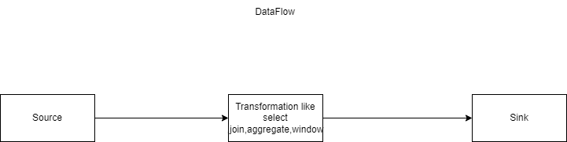

###   **Project Title**

###  **Tech Stack**

* **Data Sources**: SAP & MySQL
* **Storage**: Azure Data Lake Gen2 (Bronze, Silver, Gold)
* **Processing**: Azure Data Factory (ADF) for orchestration, Databricks for transformations
* **Database/Warehouse**: Azure Synapse Analytics
* **Visualization**: Power BI 
* **Languages**: Python (PySpark for Databricks), SQL
* **CI/CD**: Azure DevOps (Pipeline YAML files)
* **Version Control**: GitHub repo

###  **Pipeline Steps**

1. **Source Data Simulation**

   

     * **Vendor Master Data** ( SAP HANA export)
     * **Purchase Orders** (MySQL export)

2. **Azure Data Lake Setup**

 

     * **Raw (Bronze)**: Dump original data
     * **Filtered (Silver)**: Cleaned and validated
     * **Aggregated (Gold)**: Analytics-ready tables

3. **Ingestion Pipeline**

   * **Historical Load**:

      
     * ADF pipeline to copy initial full data from SAP, MySQL → Data Lake → Synapse Staging
    

    
     
   * **Incremental Load**:

      
     * Implement **Watermark method** using ADF Lookup + ForEach loop.
     * Update control table after each load.

4. **Data Transformation**

   * Using **Databricks (PySpark)**:
     
       
     * Clean nulls, deduplicate, and join datasets.
     * Apply aggregations (e.g., On-time Delivery Rate, Freight Turnaround).
     * Store results in **Gold layer** and push to Synapse for BI consumption.

5. **Data Modeling**

   * Create **Star Schema** in Synapse for Power BI reporting.

6. **BI Dashboard**

   * Power BI dashboard with KPIs: On-time Delivery %, Freight Turnaround Time, Vendor Score.

7. **CI/CD with Azure DevOps**

   * YAML pipelines for:

     * Deployment of ADF pipelines
     * Deployment of Databricks notebooks

